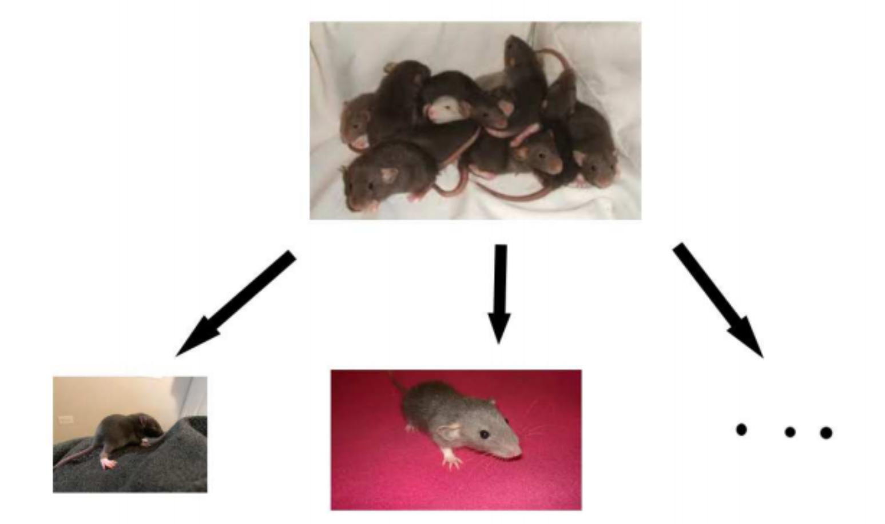
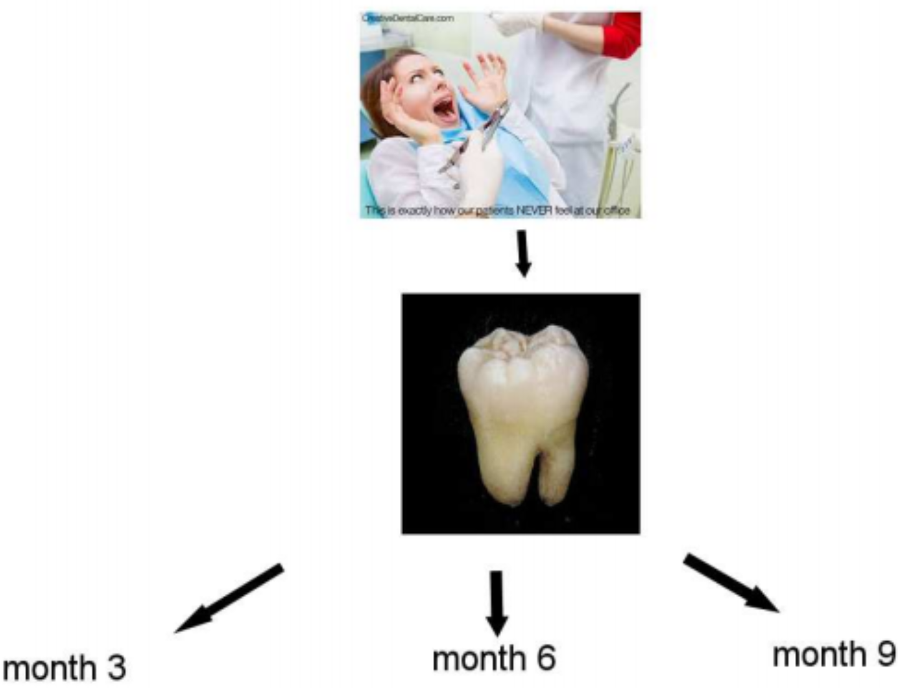

```{r setup, include=FALSE}
options(htmltools.dir.version = FALSE)
library(bookdown)
library(gridExtra)
library(dplyr)
```

#What is HLMdiag?

Give the schpiel here, transition into what is a hierarchical model

We could maybe do a roadmap if you think that is easier!

---

# Correlated data

In multiple regression, we assume that all observations are independent of one another.

This is not always the case.

.pull-left[
```{r echo=FALSE}

```
]

.pull-right[
```{r echo=FALSE}

```

]

---

# Hierarchical Structure

.center[
Clustered Data
]

 | Two-level | Three-level
----|-----------|------------
Cluster of Clusters | | School
Cluster of Observations | Litter | Classroom
Observation | Pup | Student

<br>

Litter and school are the primary sampling units

Pups and students are elements

---

# Levels of data

.center[
Clustered Data
]

 | Two-level | Three-level
-|-----------|-------------
Level 3 | |School
Level 2 | Litter | Classroom
Level 1 | Rat pup | Student

<br>

$Y_{i1}, Y_{i2}, . . . , Y_{is}$: Litter $i$, the weights of pups 1, 2, . . . , $s$.

$Y_{ij1}, Y_{ij2}, . . . , Y_{ijs}$: school $i$, classroom $j$, test scores of students
1, 2, . . . , $s$.

---

# Sources of Variability

.large[School Example]

**Variability between schools** $(\sigma^2_b)$

Type of school 

Median household income

<br>

**Variability within schools** $(\sigma^2)$

Gender

Minority

Socio-ecinomic status

---

# Random Intercept Model Formulation

For data with $n$ groups (schools) and $m_i$ observations per group (students),

**Composite Formulation:**

$Y_{i,j} = \alpha + w_i + \beta X_{i,j} + \epsilon_{i,j}$, 

for $i = 1, 2, ... , n, j = 1, 2, ..., m_i$

where $w_i ∼ N(0, \sigma^2_b)$ and $\epsilon_{i,j} ∼ N(0, \sigma^2)$.

<br>

**Hierarchical Formulation:**

**Level 1:** (variability within each school)

$Y_{i,j} = a_i + \beta X_j + \epsilon_{i,j}$ , where $i = 1, 2, . . . , n$, $j = 1, 2, ..., m_i$.

**Level 2:** (variability between students within school)

$a_i = \alpha + w_i$, where $w_i ∼ N(0, \sigma^2_b)$.

---

# Random Slope Model Formulation

**Hierarchical Formulation:**

**Level 1:**

$Y_{i,j} = a_i + b_iX_{i,j} + \epsilon_{i,j}$ , 

where $\epsilon_{i,j} ∼ N(0, \sigma^2)$.

**Level 2:** 

$a_i = \alpha + w_i$

$b_i = \beta + v_i$, where

$$
\begin{bmatrix}
u_i \\ v_i  \end{bmatrix} \sim \text{MVNorm}(\begin{bmatrix}
0 \\ 0  \end{bmatrix}, \Sigma), \Sigma = \begin{bmatrix}
\sigma_1^2 & \rho\sigma_1\sigma_2 \\
\rho\sigma_1\sigma_2 & \sigma_2^2 
\end{bmatrix}
$$

---

class: middle, inverse

# Diagnostics

---

# Residuals
<<<<<<< HEAD

.large[
**Hilden-Minton (1995)** defines three types of residuals:

   1. level-1 (conditional) residuals
$$
\epsilon_i = y_i - X_i\beta - Z_ib_i
$$

   2. higher-level (random effects) residuals
$$
Z_ib_i
$$

   3. marginal (composite) residuals
$$
\zeta_i = y_i - x_i\beta = Z_ib_i  + \epsilon_i
$$

Additionally, residual values change depending on how the fixed and random model coefficients are estimated.
]

---

# Level-1 Residuals

The level-1 residuals, $\epsilon_i = y_i - X_i\beta - Z_ib_i$, change depending on how $\beta$ and $b_i$ are estimated.

1. **Least Squares** (LS)

   - Fit seperate linear model to each group, use LS to estimate $\beta$ and $b_i$
   
   - Unconfounded with higher level residuals 
   
   - Unreliable for low sample sizes
   
2. **Empirical Bayes** (EB)

   - Conditional modes of the $b_i$s given the data and the estimated parameter values (found by maximum likelihood or restricted maximum likelihood)
   
   - Interrelated with higher level residuals
   
   - More robust at small sample sizes
   
---

# Higher-level Residuals

.large[
More commonly referred to as the random effects, $Z_ib_i$.

   - Again changes depending on method of estimation

   - Sample sizes are often small at higher levels, and interrelation is no longer an issue
   
   - Empirical Bayes estimation almost always prefered
]

---

# Marginal Residuals

.large[
Obtained by plugging in the estimate of $\beta$, $\hat{\beta}$, into the definition, $\zeta_i = y_i - x_i\beta$.

   - The sum of the level-1 and higher-level residuals
   
   - Problems in marginal residuals must be assessed through level-1 or higher-level
   
   - Marginal residuals, $\zeta_i$, and observed values, $y_i$, have the same covariance structure
]

---

# Influence

---

class: middle, inverse

# HLMdiag example and updates

---

# Classroom Data

We will use the classroom data set


