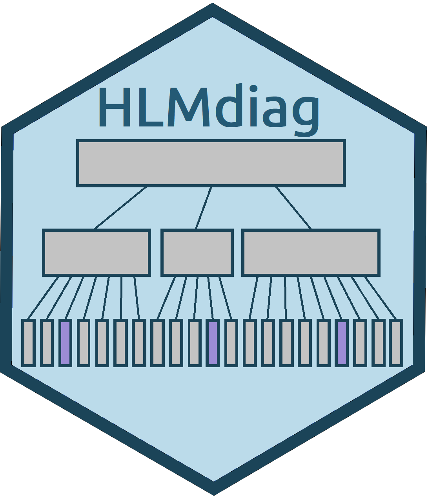

```{r setup, include=FALSE}
options(htmltools.dir.version = FALSE)
library(bookdown)
library(gridExtra)
library(dplyr)
```

#What is HLMdiag?

- An R package, created by Adam Loy in 2014

- `HLMdiag` calculates diagnostics for hierarchical linear models (HLMs)

- What we will cover in this talk: 

  - Correlated data and hierarchical linear models
  
  - Basic residual and influence analysis for HLMs
  
  - An example of how to use `HLMdiag` in practice 
  
```{r echo=FALSE, out.width = "25%", fig.align = 'center'}

```
  
---

class: middle, inverse

#Correlated Data and HLMs

---

# Correlated data

In multiple regression, we assume that all observations are independent of one another.

This is not always the case.

```{r echo=FALSE, out.width= "80%", fig.align='center'}

```

---

# Hierarchical Structure

.center[
Clustered Data
]

 | Two-level | Three-level
-|-----------|-------------
Level 3 | |School
Level 2 | School | Classroom
Level 1 | Student | Student

<br>

$Y_{i1}, Y_{i2}, . . . , Y_{is}$: School $i$, the scores of students 1, 2, . . . , $s$.

$Y_{ij1}, Y_{ij2}, . . . , Y_{ijs}$: school $i$, classroom $j$, test scores of students
1, 2, . . . , $s$.

---

# Sources of Variability

.large[School Example

**Variability between schools** $(\sigma^2_b)$

**Variability within schools** $(\sigma^2)$

]

```{r echo=FALSE, out.width= "80%", fig.align='center'}
knitr::include_graphics("figs/SchoolCluster.png")
```

---

# Hierarchical Linear Model Formulation

For data with $n$ groups (schools) and $m_i$ observations per group (students),

**Hierarchical Formulation:**

**Level 1:**

$Y_{i,j} = a_i + b_iX_{ij} + \epsilon_{ij}$ , 

where $\epsilon_{i,j} ∼ N(0, \sigma^2)$.

**Level 2:** 

$a_i = \alpha_0 + \gamma_iZ_i+  u_i$

$b_i = \beta_0 + \delta_iZ_i + v_i$, where

$$
\begin{bmatrix}
u_i \\ v_i  \end{bmatrix} \sim \text{MVNorm}(\begin{bmatrix}
0 \\ 0  \end{bmatrix}, \Sigma), \Sigma = \begin{bmatrix}
\sigma_1^2 & \rho\sigma_1\sigma_2 \\
\rho\sigma_1\sigma_2 & \sigma_2^2 
\end{bmatrix}
$$

---

class: middle, inverse

# Diagnostics

---

# Residuals

.large[
Three types of residuals for HLMs:

   1. level-1 (conditional) residuals
.center[
$\epsilon_i = y_i - X_{ij} \beta - Z_ib_i$
]
   2. higher-level (random effects) residuals
.center[
$Z_ib_i$
]
   3. marginal (composite) residuals
.center[
$\zeta_i = y_i - X_{ij} \beta = Z_ib_i  + \epsilon_i$
]

Additionally, residual values change depending on how coefficients are estimated.

]

---

# Level-1 Residuals

The level-1 residuals: $\epsilon_i = y_i - X_{ij} \beta - Z_ib_i$

1. **Least Squares** (LS)

   - Fit seperate linear model to each group, use LS to estimate $\beta$ and $b_i$
   
   - Unconfounded with higher-level residuals 
   
   - Unreliable for low sample sizes
   
2. **Empirical Bayes** (EB)

   - Conditional modes of the $b_i$s given the data and the estimated parameter values
   
   - Interrelated with higher-level residuals
   
   - More robust at small sample sizes
   
---

# Higher-level Residuals

.large[
Also known as random effects: $Z_ib_i$.

   - Depends on method of estimation
   
   - Small sample sizes, interrelation not an issue
   
   - Empirical Bayes estimation prefered
]

---

# Introduction to Influence Diagnostics

Like multiple regression, it is important to identify influential observations as part of our analysis.

For hierarchical linear models, we also need to consider influential groups. 

Using the school example, we need to consider: 
  - influential students (level 1)
  
  - influential classes (level 2)
  
  - influential schools (level 3)


There are a variety diagnostics used to quantify how influential an observation or a group is.

---
# Examples of Influence Diagnostics

**Cook's Distance**

  - a measure of how much the fixed effects changed 
  
  - compares the fixed effects without an observation or group to the original ones 
  
  
**Leverage** 

  - a measure of how the fitted values change, rather than the model parameters 
  
  - defined as the rate of change in the predicted response with respect to the observed response
  
  - we can also calculate the leverage associated with the fixed effects, the random effects, or overall

---

class: middle, inverse

# HLMdiag example and updates

---

#Updates

.large[
- `hlm_resid()`, `hlm_influence()`, and `hlm_augment()`

- conforms to tidyverse

- respects `na.action`

- implements `nlme`

- general efficiency
]

---

class: middle, inverse

# Example in R

---
class: middle, inverse

.center[
.large[
**Special thanks to:**

Adam Loy

Laura Chihara
]
]

